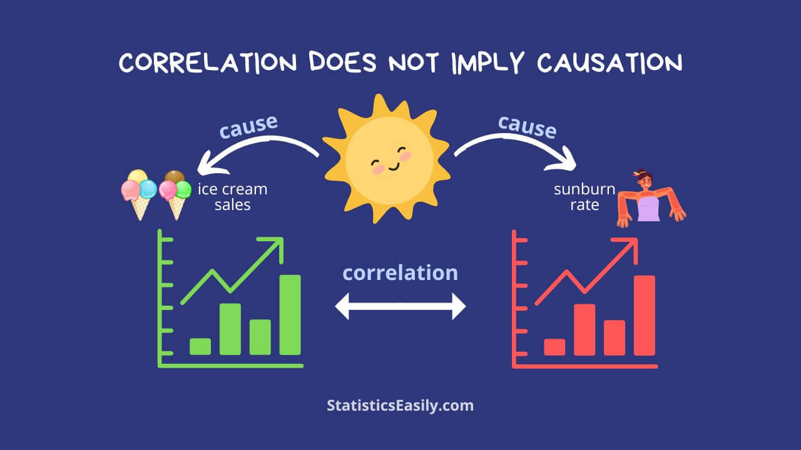
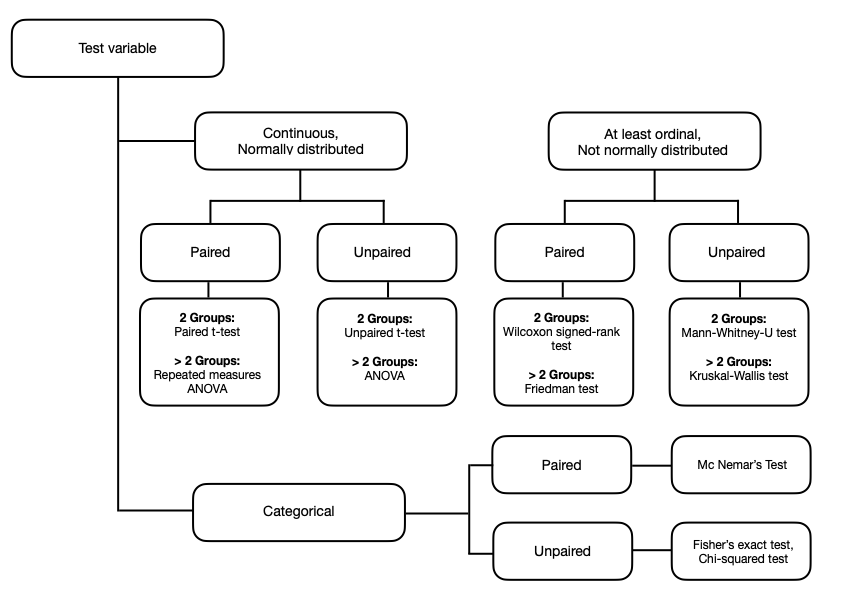

# How to draw insights from data


## Fundamentals of statistics {#sec-fundamentals}
Statistics is a scientific discipline that provides methods for collecting, describing, and analyzing data. A basic understanding of statistical concepts is essential for every data science task. Key aspects of data literacy and data proficiency for which we need statistics are:

- Interpretation of results from data analyses

- Assessment of the quality of data analyses (i.e., identification of reliable and non-reliable research)

- Conduct of data analyses (i.e., selection of appropriate data analysis methods based on context and research questions)

- Informed decision-making based on evidence

The main areas of statistics are:

- **Descriptive statistics:** methods to summarize and describe data. 

- **Inferential statistics:** methods to generalize findings from a sample to the population (confirmatory data analysis).

- **Exploratory statistics:** an approach to analyze data with the aim to generate hypotheses (e.g., identify potential trends or relationships between variables). Exploratory data analysis doesn’t allow to generalize findings to the population!

The data used for data science tasks typically represent a (random) sample (see @sec-data). That is, the sample data can be considered to come from a random experiment. A **random experiment** is a process with multiple possible outcomes, whose outcome cannot be predicted in advance. It can be repeated several times under the same conditions, with each repetition potentially leading to a different outcome. A classic example of a random experiment is rolling a fair six-sided die. While all possible outcomes -- $\{1,2,3,4,5,6\}$ -- are known, it is not possible to predict which specific number will appear on any single roll. Likewise, when sampling new units (i.e., generate new data for a specific data science task) under the same conditions, we would usually observe some outcomes that differ from those of a previous sample. 

The features of a sample (e.g., age, height,...), can be interpreted as a **random variable**. It is assumed that each feature (variable) has an underlying **probability distribution** that describes how likely each possible outcome of the variable is. We distinguish between continuous and discrete probability distributions. A continuous probability distribution describes probabilities for the possible outcomes of a feature (random variable) that can take any value within a defined range (e.g., height, weight, gas price). A discrete probability distribution describes probabilities for the possible outcomes of a feature that can take on a countable or finite number of distinct values or categories (e.g., result of a die roll, grade, gender). Note that a discrete probability distribution (or random variable) corresponds to the data types *nominal, ordinal*, and *quantitative-discrete* (see @sec-data).

A well-known example of a continuous probability distribution is the **Normal distribution**. The shape of the Normal distribution $\mathcal N(\mu, \sigma^2)$ is described by two parameters -- the mean $\mu$ and the variance $\sigma^2$.

```{r}
#| label: normal-dist
#| fig-cap: "Shapes of different normal distributions."
#| warning: false
#| echo: false

library(tidyverse)
library(tableHTML)
library(MASS)
library(palmerpenguins)

set.seed(397)
x = seq(from = -4, to = 4, by = 0.05)
norm_dat_1 = data.frame(dist = "N(0,1)", x = x, pdf = dnorm(x))
norm_dat_2 = data.frame(dist = "N(1,4)", x = x, pdf = dnorm(x, mean = 1, sd = 2))
norm_dat_3 = data.frame(dist = "N(-1, 0.25)", x = x, pdf = dnorm(x, mean = -1, sd = 0.5))
norm_dat = rbind(norm_dat_1, norm_dat_2, norm_dat_3)
ggplot(norm_dat) + 
  geom_line(aes(x = x, y = pdf, color = dist)) +
  ylab("Probability density function")
```

Whether a variable is normally distributed can, e.g., be checked using a histogram:

```{r}
#| label: normal-his
#| fig-cap: "Empirical distribution of body weight."
#| warning: false
#| echo: false

set.seed(056)
weights = data.frame(value=rnorm(1000, 70, 10))
ggplot(weights, aes(x=value)) + 
  geom_histogram(aes(y =..density..),
                 colour = "black", 
                 fill = "lightgreen",
                 bins = 12) + 
  ylab("Density") + xlab("Body weight (kg)") +
  stat_function(fun = dnorm, args = list(mean = mean(weights$value), 
                                         sd = sd(weights$value)))
```
A classical example of a discrete probability distribution is the **Uniform distribution** $\mathcal U[a, b]$ that is defined by two parameters -- a lower bound $a$ and an upper bound $b$, where all outcomes in the set are equally likely. The graphic below shows the Uniform distribution resulting from a fair roll of a die. 

```{r}
#| label: uniform
#| fig-cap: "Discrete uniform distribution of a fair six-sided die roll."
#| warning: false
#| echo: false
#| 
dat = data.frame(name=1:6, value=rep(1/6, 6))
ggplot(dat, aes(x=factor(name), y=value)) + 
  geom_bar(stat = "identity", fill = "lightblue") +
  xlab("Outcome") + ylab("Prabability")
```

## Descriptive statistics {#sec-descriptive}

### Univeriate descriptive statistics {#sec-unidesc}
Univariate descriptive statistics are metrics that help to understand the characteristics of a single variable. Depending on the data type, different metrics can be used.

Key types of descriptive statistics for *quantitative variables* are:

- Measures of central tendency: describe the "middle" of the data\
e.g., mean, median, mode
- Measures of variability: quantify how spread out or clustered together data are\
e.g., variance, standard deviation,
interquartile range (IQR)
- Measures of position: describe a relative position of a value in reference to others\
e.g., quartiles, minimum, maximum
- Shape of the distribution:\
e.g., skewness
- Graphical methods: \
e.g., boxplot, histogram

Key types of descriptive statistics for *qualitative variables* are:

- Frequency distribution: shows how often values occur\
e.g., frequency tables (absolute, relative)
- Measures of central tendency and variability:\
e.g., mode, median (only for ordinal variables), IQR (only for ordinal variables)
- Graphical methods:
e.g., bar chart, pie chart

Below are definitions of the most common descriptive statistics.

#### **Mean** {-}
Let $x = (x_1,\ldots,x_n)$ be realizations of a continuous variable $X$. The arithmetic mean is defined as
$$
\begin{align*}
\bar x = \sum_{i = 1}^n x_i
\end{align*}
$$
Note that the arithmetic mean is sensitive to outliers in the data!

[Example]{.underline}:
$$
\begin{flalign}
&x = (23, 26, 65, 47, 21, 44, 49, 52) &&\\[1em]
&\bar x = \frac{1}{8} (23 + 26 + 65 + 47 + 21 + 44 + 49 + 52) = \frac{1}{8} \cdot 327 = 40.875 &&
\end{flalign}
$$

#### **Median** {-}
Let $x = (x_{(1)},\ldots,x_{(n)})$ be the realizations of a variable $X$, that is at least ordinal, sorted in ascending order. The median is defined as
$$
\begin{align*}
\text{med}(x) = 
\begin{cases} 
x_{\left( \frac{n+1}{2} \right)} & \text{ if } n \text{ is odd}\\[1.5em]
\frac{1}{2} \left(x_{\left(\frac{n}{2}\right)} + x_{\left( \frac{n+1}{2} \right)} \right) & \text{ if } n \text{ is evan}\\
\end{cases}
\end{align*}
$$
[Example]{.underline}:
$$
\begin{flalign*}
&x = (23, 26, 65, 47, 21, 44, 49, 52, 33) &&\\[1em]
&\rightarrow (x_{(1)},\ldots,x_{(9)}) = (21, 23, 26, 33, 44, 47, 49, 52, 65) &&\\[1em]
&\text{med}(x) = x_{(5)} = 44 &&\\[1em]
&\bar x = \frac{1}{9} (21, 23, 26, 33, 44, 47, 49, 52, 65) = 40 &&
\end{flalign*}
$$

#### **Mode** {-}
The mode is the most frequent occurring realization of a variable $X$. It is not necessarily unique. If each value in a sample occurs precisely once, the concept is unusable in its raw form.

[Example]{.underline}:
$$
\begin{flalign*}
&(x_{(1)},\ldots,x_{(10)}) = (3, 3, 4, 5, 5, 5, 7, 9, 9, 11) &&\\[1em]
&\text{mod}(x) = 5 &&
\end{flalign*}
$$

#### **$\boldsymbol p$-Quantile** {-}
Let $x = (x_{(1)},\ldots,x_{(n)})$ be the realizations of a variable $X$, that is at least ordinal. The $p$-quantile, with $p \in (0, 1)$, is the value below which $100 \cdot p\%$ of the realizations lie, it is defined as
$$
\begin{align*}
Q_p = 
\begin{cases} 
x_{\left(\lceil n \cdot p \rceil\right)} & \text{ if } n \cdot p \text{ is not an integer}\\[1.5em]
\frac{1}{2} \left(x_{\left(n \cdot p\right)} + x_{\left( n \cdot p + 1 \right)} \right) & \text{ if } n \cdot p \text{ is an integer}\\
\end{cases}
\end{align*}
$$

Note that $Q_{0.5}$ is the median.

[Example]{.underline}:
$$
\begin{flalign*}
&(x_{(1)},\ldots,x_{(9)}) = (21, 23, 26, 33, 44, 47, 49, 52, 65) &&\\[1em]
&Q_{0.25} =  x_{(3)} = 26; \quad Q_{0.75} =  x_{(7)} = 49&&
\end{flalign*}
$$

#### **Variance** {-}
Let $x = (x_1,\ldots,x_n)$ be realizations of a continuous variable $X$. The variance is defined as
$$
\begin{align*}
\text{var} (x) = \frac{1}{n-1}\sum_{i = 1}^n (x_i - \bar x)^2
\end{align*}
$$

#### **Standard deviation** {-}
Let $x = (x_1,\ldots,x_n)$ be realizations of a continuous variable $X$. The variance is defined as
$$
\begin{align*}
\text{sd} (x) = \sqrt{\text{var} (x)}
\end{align*}
$$

#### **Interquartile range (IQR)** {-}
Let $x = (x_{(1)},\ldots,x_{(n)})$ be the realizations of a variable $X$, that is at least ordinal. The IQR is defined as
$$
\begin{align*}
\text{QD} = p_{0.75} - p_{0.25}
\end{align*}
$$

#### **Skewness** {-}
Skewness is a measure of the asymmetry of a probability distribution around its mean. We distinguish:

- Symmetric distribution: the left and right side of the distribution are mirror images of each other around a central peak
- Right-skewed distribution: the majority of data values are concentrated on the left side of the distribution. The tail on the right side is longer and wider. 
- Left-skewed distribution: the majority of data values are concentrated on the right side of the distribution. The tail on the left side is longer and wider. 

```{r}
#| label: skewness
#| fig-cap: "Example of symmetric and skewed distributions."
#| warning: false
#| echo: false
 
set.seed(256)
x = 0:100
y = c(dnorm(x, mean=50, sd=10), 
      dlnorm(x, meanlog=3, sdlog=.7), 
      dlnorm(100-x, meanlog=3, sdlog=.7))
df = data.frame(x=x, y=y, type=rep(c("symmetric", "right-skewed", "left-skewed"), each=101))
ggplot(df, aes(x, y, color=type)) + geom_line() +
  ylab("Probability density function")
```
In a perfectly symmetrical distribution, the mean, median, and mode are equal.
When dealing with skewed distributions, the arithmetic mean, variance, and standard deviation are often inadequate as they fail to represent the "middle" or spread of the data. Skewness shifts the mean toward the long tail of the distribution, making it a poor indicator of central tendency and variability. 
When a distribution is skewed, it is often better to use measures such as the median, quantiles, and the IQR, as these are robust (i.e., not strongly affected by extreme values). To decide whether a distribution is (overly) skewed graphical methods like histograms can be used. Alternatively the empirical skewness can be calculated. As a rough guideline, the empirical skewness should lie between $-1$ and $1$ for a distribution to be considered approximately symmetric.


| Measure | $|$skewness$|$ $\leq 1$  | $|$skewness $> 1$$|$ | 
|---------|:-----|:------|
| mean      | adequate   | often inadequate |
| variance, standard deviation | adequate  | often inadequate |
| median, quantiles       | adequate  | adequate |
| IQR      | adequate   |     adequate |


#### **Frequencies** {-}
Given $n$ observations, assigned to $K$ classes $\,A_1,\ldots,A_K$,  $K \leq n$. The absolute frequency of class $A_k$
$$
\begin{align*}
H(A_k) &= \text{number of observations in class } A_k, \text{ with}\\[1em] 
n &= \sum_{k=1}^K H(A_k), \quad k = 1,\ldots,K
\end{align*}
$$
The relative frequency of class $A_k$ is given by
$$
\begin{align*}
h(A_k) &= \frac{1}{n} H(A_k), \quad k = 1,\ldots,K, \text{ with} \\[1em]
1 &= \frac{1}{n} \sum_{k=1}^K H(A_k)
\end{align*}
$$

#### **Visualization methods** {-}

**Histogram**\
A histogram is a visual representation of the distribution of a continuous variable. It requires the data to be divided into $K$ bins (i.e., intervals) of the form $A_k = (a_{k-1}, a_k], \, k = 1,\ldots,K$, with $a_0 < x_i \leq a_K \,\text{ for all } \,i \in \{1,\ldots,n\}$. The bins are typically (but not required to be) of equal size.

Denote:

- bin width: $b_k = a_k - a_{k-1}$

- absolute frequency: $H(A_k)$

- relative frequency: $h(A_k)$

- probability density: $f_k = \frac{h(A_k)}{b_k}$

Plotting of bars with height $f_k$ (y-axis) over the bins $A_k$ (x-axis) yields the histogram. It is also possible to plot the bins against the corresponding absolute frequencies.

[Example]{.underline}: Histogram and underlying data table of the variable "sepal length" of the `R` data set `iris`.

:::: {.columns}
::: {.column width="40%"}
```{r}
#| label: histo_tab
#| warning: false
#| echo: false
#| results: 'asis'

hg = hist(iris$Sepal.Length, plot = FALSE)
tab = do.call(cbind.data.frame, hg[][2:3])
bin = c("(4.0, 4.5]", "(4.5, 5.0]", "(5.0, 5.5]", "(5.5, 6.0]", "(6.0, 6.5]", "(6.5, 7.0]", "(7.0, 7.5]", "(7.5, 8.0]")
tab2 = cbind(bin, tab)
tab2$density = round(tab2$density, 2)
tab2 %>%
  tableHTML(widths = rep(100, 3), rownames=FALSE)
```
:::
::: {.column width="55%"}
```{r}
#| label: histo
#| warning: false
#| echo: false
#| fig.height: 6
#| fig.width: 5 

hist(iris$Sepal.Length, freq = FALSE, xlab = "Sepal length", main = "Iris data")
```
:::
::::

The choice of the bin width / number of bins impacts the shape of the histogram. There are various algorithms for automatically selecting the number of bins:
```{r}
#| label: histo2
#| warning: false
#| echo: false
#| fig.height: 4

par(mfrow = c(1, 3))
hist(iris$Sepal.Length, freq = FALSE, xlab = "Sepal length", main = "7 breaks", breaks = 7)
hist(iris$Sepal.Length, freq = FALSE, xlab = "Sepal length", main = "3 breaks", breaks = 3)
hist(iris$Sepal.Length, freq = FALSE, xlab = "Sepal length", main = "15 breaks", breaks = 15)
```

**Boxplot**\
A boxplot is a visualization of distributional characteristics of a variable that is measured on at least an ordinal scale. It shows the median, $0.25$- and $0.75$-quantile, IQR, minimum, maximum, and potential outliers (see below).

{fig-align="center"}

[Example]{.underline}: Boxplot of the variable "sepal width" of the `R` data set `iris`.
```{r}
#| label: boxplot
#| warning: false
#| echo: false
#| fig.height: 3

ggplot(iris, aes(Sepal.Width)) + geom_boxplot(fill = "lightgreen") +
  theme_bw() + ylim(-1, 1) +
  theme(axis.text.y = element_blank()) + xlab("Sepal width")
```

**Bar chart**\
A bar chart displays the frequency distribution of a qualitative variable by bars whose height corresponds to the absolute or relative frequency of the outcome category.

[Example]{.underline}: Bar chart of the variable "species" from the Palmer Archipelago (Antarctica) penguin data [@horst20].
```{r}
#| label: barchart
#| warning: false
#| echo: false
#| fig.height: 4

dat = penguins %>% count(species)
ggplot(dat, aes(x=species, y=n)) +
  geom_bar(stat="identity") +
  ylab("Absolute frequency") + xlab("Species")
```

**Pie chart**\
A pie chart displays the relative frequency distribution of a qualitative variable by dividing a circle into slices that represent the outcomes of the variable and are sized based on the relative frequency of the corresponding outcome.

[Example]{.underline}: Pie chart of the variable "species" from the Palmer Archipelago (Antarctica) penguin data [@horst20].
```{r}
#| label: pie
#| warning: false
#| echo: false
#| fig.height: 4

ggplot(dat, aes(x="", y=n, fill=species)) +
  geom_bar(stat="identity", width=1) +
  coord_polar("y", start=0)
```


### Bivariate descriptive statistics
Bivariate descriptive statistics help to understand the relationship between two variables. Depending on the data type of each variable, different metrics can be used.

Key types of descriptive statistics for *two quantitative variables* are:

- Measures of correlation: quantify the strength and direction of the association\
e.g., Pearson correlation coefficient, Spearman's rank correlation coefficient
- Graphical methods\
e.g., scatter plot

Key types of descriptive statistics for *two qualitative variables* are:

- Measures of correlation: quantify the strength (and direction) of the association\
e.g., contingency table, relative risk (RR), odds ratio (OR)
- Graphical methods\
e.g., stacked bar charts

Key types of descriptive statistics for *one qualitative* and *one quantitative variable* are:

- Measures of central tendency, position and variability (see @sec-unidesc) per category
- Graphical methods\
e.g., histogram, boxplot per category

Below are definitions of the most common bivariate descriptive statistics.

#### **Pearson correlation coefficient** {-}
Let $x = (x_1,\ldots,x_n)$ and $y = (y_1,\ldots,y_n)$ be realizations of two continuous variables $X$ and $Y$, respectively. The Pearson correlation coefficient is defined as
$$
\begin{align*}
r_{xy}^P = \frac{\sum_{i=1}^n (x_i - \bar x)(y_i - \bar y)}{\sqrt{\sum_{i=1}^n (x_i - \bar x)^2 \cdot \sum_{i=1}^n (y_i - \bar y)^2}}
\end{align*}
$$
with  $-1 \leq r_{xy}^P \leq 1$.

The Pearson correlation coefficient measures linear relationships, it is:

- $r_{xy}^P > 0 \;$: implies a positive correlation between $X$ and $Y$

- $r_{xy}^P < 0\;$: implies a negative correlation between $X$ and $Y$

- $|r_{xy}^P| = 1 \;$: a linear equation describes the relationship between $X$ and $Y$ perfectly, with all data points lying exactly on a line

The closer $r_{xy}^P$ is to $0$, the weaker the correlation between $X$ and $Y$. 

#### **Spearman's rank correlation coefficient** {-}
Let $x = (x_1,\ldots,x_n)$ and $y = (y_1,\ldots,y_n)$ be realizations of two variables $X$ and $Y$, respectively, that are at least ordinal. Spearman's rank correlation coefficient is defined as
$$
\begin{align*}
r_{xy}^S = \frac{\sum_{i=1}^n \left(R(x_i) - \bar R_x\right)\left(R(y_i) - \bar R_y\right)}{\sqrt{\sum_{i=1}^n \left(R(x_i) - \bar R_x\right)^2 \cdot \sum_{i=1}^n \left(R(y_i) - \bar R_y\right)^2}},
\end{align*}
$$
where
$$
\begin{align*}
R(x_i) = \{\# j \in \{1,\ldots,n\} | x_j \leq x_i\} - 
\frac{\{\# j \in \{1,\ldots,n\} | x_j = x_i\} - 1}{2}
\end{align*}
$$
denotes the rank of $x_i$ and $-1 \leq r_{xy}^S \leq 1$.

Spearman's rank correlation coefficient measures monotonic relationships, it is:

- $r_{xy}^S > 0 \;$: implies a positive correlation between $X$ and $Y$

- $r_{xy}^S < 0 \;$: implies a negative correlation between $X$ and $Y$ 

- $|r_{xy}^S| = 1 \;$: a monotonic function describes the relationship between $X$ and $Y$ perfectly

The closer $r_{xy}^S$ is to $0$, the weaker the correlation between $X$ and $Y$. Spearman's rank correlation coefficient can be used for ordinal or skewed data, or when the relationship between two variables is not linear.

[Example]{.underline}:
```{r}
#| label: pearson
#| fig-cap: Scatter plots with different correlation strengths
#| warning: false
#| echo: false
#| fig.height: 4

set.seed(965)
n = 100

# 1. Strong Positive Correlation (0.8)
data_pos = mvrnorm(n, mu = c(0, 0), Sigma = matrix(c(1, 0.8, 0.8, 1), 2, 2))
df_pos <- as.data.frame(data_pos)
colnames(df_pos) <- c("x", "y")
df_pos$type <- "Strong positive correlation"
P_pos = cor(data_pos[,1], data_pos[,2])
S_pos = cor(data_pos[,1], data_pos[,2], method = "spearman")
df_pos$label = sprintf("Pearson: %.2f, Spearman: %.2f", P_pos, S_pos)

# 2. Moderate negative Correlation (-0.5)
data_neg <- mvrnorm(n, mu = c(0, 0), Sigma = matrix(c(1, -0.5, -0.5, 1), 2, 2))
df_neg <- as.data.frame(data_neg)
colnames(df_neg) <- c("x", "y")
df_neg$type <- "Moderate negative correlation"
P_neg = cor(data_neg[,1], data_neg[,2])
S_neg = cor(data_neg[,1], data_neg[,2], method = "spearman")
df_neg$label = sprintf("Pearson: %.2f, Spearman: %.2f", P_neg, S_neg)

# 3. Weak Correlation (0)
data_none <- mvrnorm(n, mu = c(0, 0), Sigma = matrix(c(1, 0, 0, 1), 2, 2))
df_none <- as.data.frame(data_none)
colnames(df_none) <- c("x", "y")
df_none$type <- "Weak correlation"
P_none = cor(data_none[,1], data_none[,2])
S_none = cor(data_none[,1], data_none[,2], method = "spearman")
df_none$label = sprintf("Pearson: %.2f, Spearman: %.2f", P_none, S_none)

df_all <- rbind(df_pos, df_neg, df_none)
ggplot(df_all, aes(x = x, y = y)) +
  geom_point(alpha = 0.6) +
  #geom_smooth(method = "lm", color = "red") +
  facet_wrap(type~label) +
  theme_minimal() 
```

#### **Contingency tables** {-}
A contingency table is a cross-tabulation, i.e., a table in matrix format that displays the frequency distribution of two qualitative variables $A$ and $B$. Let

- $a_i$, $i = 1,\ldots,n$ be the outcomes of variable $A$
- $b_j$, $j = 1,\ldots,m$ be the outcomes of variable $B$
- $H_{ij}$ denote the absolute frequency of subjects with outcome $(a_i, b_j)$

The contingency table of $A$ and $B$ has the following format:

+--------------+------------------------------------------------+
| Feature A    |           Feature B                            |
|              +------------+-----------+-----------+-----------+
|              | $b_{1}$    | $b_{2}$   | $b_{3}$   | ...       |
+==============+============+===========+===========+===========+
| $a_{1}$      | $H_{11}$   | $H_{12}$  | $H_{13}$  | ...       |
+--------------+------------+-----------+-----------+-----------+
| $a_{2}$      | $H_{21}$   | $H_{22}$  | $H_{23}$  | ...       |
+--------------+------------+-----------+-----------+-----------+
| $a_{3}$      | $H_{31}$   | $H_{32}$  | $H_{33}$  | ...       |
+--------------+------------+-----------+-----------+-----------+
| ...          | ...        | ...       | ...       | ...       |
+--------------+------------+-----------+-----------+-----------+

\
[Example]{.underline}: 3x3 contingency table of education level vs. job satisfaction

+--------------+------------------------------------+
| Education    |           Satisfaction             |
|              +------------+-----------+-----------+
|              | Low        | Medium    | High      | 
+==============+============+===========+===========+
| High School  | 34         | 46        | 20        |
+--------------+------------+-----------+-----------+
| Bachelor     | 18         | 53        | 39        |
+--------------+------------+-----------+-----------+
| Master       | 11         | 31        | 48        |
+--------------+------------+-----------+-----------+


#### **Relative risk (RR)** {-}
The relative risk (RR) is the ratio of two risks:

- the risk of an event in one group *versus* 
- the risk of the event in another group

A risk is the probability for the occurrence of an event (outcome). Is is calculated as the number of events divided by the the total number of outcomes (i.e., risk = [number of events]/[number of events + number of non-events]). The RR measures the magnitude of association between a binary exposure (e.g., treatment, risk factor) and a binary outcome (e.g., disease status, death).

The RR can be estimated from a 2x2 contingency table:

+-------------+-----------+
| Exposure    |  Event    |
|             +-----+-----+
|             | Yes | No  |
+=============+=====+=====+
| **Yes**     | a   | b   |
+-------------+-----+-----+
| **No**      | c   | d   |
+-------------+-----+-----+

\
It is calculated as follows:
$$
\begin{align}
RR = \frac{a/(a + b)}{c/(c + d)}
\end{align}
$$
Note that the definition of the RR may differ from the one above, if the variables and their binary outcomes are arranged differently in the rows and column of the contingency table. For the definition above the RR is interpreted as follows:

- RR > 1: implies that the risk of the event is increased by the exposure
- RR < 1: implies that the risk of the event is decreased by the exposure
- RR = 1: implies that the exposure does not affect the outcome

Note that the RR can not be calculated in case-control studies, i.e. in retrospective studies in which subjects are selected based on their event status (outcome). In case-control studies the odds ratio (defined in the next section) can be used as an alternative measure to the RR.

[Example]{.underline}: Results from a clinical trial of selective laser trabeculoplasty compared with timolol eye drops for controlling intraocular pressure in adults with open angle glaucoma living in Tanzania [@philippin21].

+---------------------------------------+-------------------+
| Treatment                             |  Event            |
|                                       +---------+---------+
|                                       | Failure | Success |
+=======================================+=========+=========+
| Selective laser trabeculoplasty (SLT) | 64      | 99      |
+---------------------------------------+---------+---------+
| Timolol eye drops                     | 121     | 55      |
+---------------------------------------+---------+---------+

\ 
The RR of treatment failure is 
$$
\begin{flalign}
&RR = \frac{64/(64+99)}{121/(121+55)} = \frac{0.39}{0.69} = 0.57 &&
\end{flalign}
$$
The risk of treatment failure in patients treated with SLT is $0.57$ times the risk of treatment failure in patients treated with timolol eye drops. Another way to report this result is by using the relative risk reduction (RRR = 1 - RR), which measures how much an exposure reduces the risk of an event relative to a control group. In our example, it is $RRR = 1 - 0.57 = 0.43$, meaning that SLT decreases the risk of treatment failure by $43\%$ compared to timolol eye drops.

#### **Odds ratio (OR)** {-}
The odds ratio (OR) is the ratio of two odds:

- the odds of an event in one group *versus* 
- the odds of the event in another group

An odds is the chance for the occurrence of an event (outcome). It is calculated as the number of events divided by the number of non-events (i.e., odds = [number of events]/[number of non-events]). The OR measures the magnitude of association between a binary exposure (e.g., treatment, risk factor) and a binary outcome (e.g., disease status, death).

The OR can be estimated from a 2x2 contingency table:

+-------------+-----------+
| Exposure    |  Event    |
|             +-----+-----+
|             | Yes | No  |
+=============+=====+=====+
| **Yes**     | a   | b   |
+-------------+-----+-----+
| **No**      | c   | d   |
+-------------+-----+-----+

\
It is calculated as follows:
$$
\begin{align}
OR = \frac{a/b}{c/d}
\end{align}
$$
Note that the definition of the OR may differ from the one above, if the variables and their binary outcomes are arranged differently in the rows and column of the contingency table. For the definition above the OR is interpreted as follows:

- OR > 1: implies that the odds of the event is increased by the exposure
- OR < 1: implies that the odds of the event is decreased by the exposure
- OR = 1: implies that the exposure does not affect the outcome

The OR approximates the RR (i.e., OR $\approx$ RR), if the event is rare. In contrast to the RR it can also be calculated in case-control studies. However, the RR is often preferred over the OR whenever it is possible to calculate it.  

[Example]{.underline}: Going back to the example already used to demonstrate the calculation and interpretation of the RR (see section above), the OR of treatment failure is 
$$
\begin{flalign}
&OR = \frac{64/99}{121/55} = \frac{0.65}{2.2} = 0.29 &&
\end{flalign}
$$
The odds of treatment failure in patients treated with SLT is $0.29$ times the odds of treatment failure in patients treated with timolol eye drops. That is SLT decreases the odds of treatment failure by $(1 - 0.29) \cdot 100\% = 71 \%$ compared to timolol eye drops.

#### **Graphical methods** {-}

**Scatter plot**\
A scatter plot displays the relationship between two quantitative variables $X$ and $Y$ by mapping each pair $(x_i, y_i)$, $i=1,\ldots,n$, of outcome as a point in a Cartesian coordinate system.

[Example]{.underline}: Scatter plot of the variables "mpg" (miles per gallon) and "wt" (weight) of the `R` data set `mtcars`.
```{r}
#| label: scatter
#| warning: false
#| echo: false
#| fig.height: 4

ggplot(mtcars, aes(x=wt, y=mpg)) + 
  geom_point() + 
  ylab("Miles per gallon") + xlab("Weight of the car")
```

**Stacked bar chart**\
A stacked bar chart is an extension of a simple bar chart that displays the frequency distribution of two qualitative variables $A$ and $B$ with outcomes $a_1,\ldots,a_n$ and $b_1,\ldots,b_m$, respectively. A bar is drawn for each outcome $a_i$, $i=1,\ldots,n$ of $A$ whose total hight represents the frequency of subjects with outcome $a_i$ in the sample. Each bar is further divided into $m$ segments stacked end to end. The height of segment $j$, $j = 1,\ldots,m$ in bar $a_i$ represents the frequency of subjects with outcome $(a_i, b_j)$.

[Example]{.underline}: Stacked bar chart of the variables "species" and "island" from the Palmer Archipelago (Antarctica) penguin data [@horst20].
```{r}
#| label: stacked
#| warning: false
#| echo: false
#| fig.height: 4

dat = penguins %>% count(species, island)
ggplot(data=dat, aes(x=island, y=n, fill=species)) +
  geom_bar(stat="identity") +
  xlab("Island") + ylab("Absolute frequency")
```


## Correlation vs. causation
Note that correlation does not imply causation!
While correlation indicates an association where two variables move together (i.e., event A and B happen simultaneously), causation means that one variable directly produces a change in the other variable (i.e., A causes B or vice versa). We cannot simply assume causation even when two events are happening simultaneously. Let's illustrate this with a simple example. The graphic below shows a positive correlation between ice cream sales and the incidence of sunburn, i.e., an increase in "eating ice cream" is accompanied with an increase in "getting sunburned". However, neither event causes the other. Instead, there is a third variable -- "sunny weather" -- that causes both events.  

{fig-align="center"}

The spurious correlation illustrated above is just one of several possible causes of a correlation between two variables. When interpreting correlations it is thus important to keep the difference between correlation and causation in mind.


## Finding causal effects
As outlined in the previous chapter, a correlation between two variables does not necessarily imply a causal relationship. So how can we detect a causal relationship if it truely exists? 

Different techniques and frameworks have been developed to better understand the relationship between variables.
**Randomized controlled trials** (RCTs) are widely considered the gold standard for evaluating causal relationships. In RCTs participants are randomly assigned to either an experimental group (receiving an intervention)
or a control group (receiving placebo or standard of care). By using random assignment, RCTs ensure that, on average, the groups are comparable, making
an observed difference in outcomes attributable to the intervention itself. RCTs are thus a powerful tool for investigating causal relationships.\

The degree of confidence that the causal relationship being tested in a (study) sample is trustworthy and not influenced by other factors or variables is referred to as **internal validity**. High internal validity is often achieved through RCTs, as randomization and the controlled experimental setting reduce potential bias. Internal validity depends on:

- experimental design (randomization, blinding, control group)
- definition of what data is to be collected and how (study protocol)
- data analysis methods

In contrast, **external validity** measures the extend to which causal findings from a sample can be generalized to other populations, settings, or times. It depends on:

- size and characteristics (representativeness) of the sample $\rightarrow$ restrictions in inclusion and exclusion criteria
- reproducibility of methodological conditions (implementation of the intervention) of the study in routine practice

Notice that high internal validity is a prerequisite for high external validity. In practice, however, these two aspects often conflict with one another. While a very controlled experimental design enhances internal validity, it can compromise external validity. 


## Inferential statistics {#sec-inferential}

In most data analysis applications we will study a (random) sample of the full population of interest. The sample data can be considered to come from a random experiment (see @sec-fundamentals). If we want to draw conclusions about the population we need to check, whether an effect, that we observe in the sample, is a systematic effect or just due to chance. Inferential statistics are methods based on probability theory that allow us to generalize findings from the sample to the population. 

### Hypothesis testing {#sec-testing}

A key concept of inferential statistics is **hypothesis testing**. A statistical hypothesis test evaluates a pair of two mutually exclusive statements -- the null hypothesis ($H_0$) and the alternative hypothesis ($H_1$). The null hypothesis represents an assumption that should be disproved (rejected), while the alternative hypothesis represents an assumption that should be verified. Typically, the alternative hypothesis claims that some kind of "effect" exists between two or more conditions. This "effect" can be, e.g., a difference or change in a population parameter (e.g., mean, proportion,...). Let's have a look at a few examples.

Imagine the following situation. Researchers want to know if a new teaching method increases the pass rate on the final exam. For this purpose students are randomly assigned to one of two learning groups, in which either the traditional teaching method or the new teaching method is used. The research question can be translated into the following pair of statistical hypotheses: 

- $H_0$: There is no difference in the pass rate between the two learning groups.
- $H_1$: There is a difference in the pass rate between the two learning groups.

If we denote the pass rate of the learning groups by $p_1$ and $p_2$, respectively, we could alternatively formulate the hypotheses in terms of population parameters:

- $H_0$: $p_1 = p_2$.
- $H_1$: $p_1 \ne p_2$.

Another situation in which we might be interested in performing a statistical hypothesis test would be a clinical trial that aims to assess whether a new antihypertensive drug is more effective than placebo in reducing systolic blood pressure (SBP). The corresponding hypotheses of interest could be:

- $H_0$: There is no difference in the mean SBP reduction between treatment groups (i.e., antihypertensive drug vs. placebo).
- $H_1$: There is a difference in the mean SBP reduction between treatment groups.

Denoting the mean SBP reduction per group by $\mu_1$ and $\mu_2$, respectively, this could alternatively be formulated in terms of population parameters:

- $H_0$: $\mu_1 = \mu_2$.
- $H_1$: $\mu_1 \ne \mu_2$.

You may have noticed that each pair of hypotheses in the examples above is non-directional (i.e., it does not predict a specific direction of difference). A statistical test that checks a non-directional hypothesis (i.e., differences in either direction) is referred to as **two-tailed test**.
It is also possible to check for a specific direction of difference (greater than or less than). Statistical tests that check a directional hypothesis are referred to as **one-tailed tests**. Directional hypotheses are of the form "$\geq$" or "$\leq$", e.g.

- $H_0$: $\mu_1 \leq \mu_2$ vs. $\mu_1 > \mu_2$ (right-tailed).
- $H_1$: $\mu_1 \geq \mu_2$ vs. $\mu_1 < \mu_2$ (left-tailed).

Many statistical hypothesis tests can be used in both one- and two-tailed form. When planning a statistical test, we usually assume a specific direction of difference and are interested in proving this direction (e.g., superiority of a drug over another). In most settings, however, a two-tailed test will be preferred over a one-tailed test. This is due to regulatory requirements that were originally developed for clinical trials, but have become gold standard in other settings as well. The reason for preferring two-tailed tests is that they allow to detect differences in either direction, thereby making it possible to also prove an unexpected result. If we use a two-tailed test, we can infer the direction of difference based on the corresponding effect estimates (e.g., mean, proportion,...), as long as the test yields a significant result. A significant test result means that we reject the null hypothesis and assume the alternative hypothesis. We will dive into that in more detail within the following section.

A statistical hypothesis test can be interpreted as a decision process with four possible outcomes, summarized in the table below:

+------------------------+-------------------------------+
| Test                   |  Truth in reality             |
| decision               +--------------+----------------+
|                        | $H_0$        | $H_1$          |
+========================+==============+================+
| Fail to reject $\,H_0$ | TRUE         | Type II error  |
+------------------------+--------------+----------------+
| Reject $\,H_0$         | Type I error | TRUE           |
+------------------------+--------------+----------------+

\
Based on the sample data, the result of the test can either be to reject $H_0$ (i.e., confirmation of $H_1$) or to to fail to reject $H_0$. As the test decision relies on sample data rather than on the entire population, two decision errors are possible, which are referred to as type I and the type II error. A **type I error** occurs when $H_0$ is rejected even though it is actually true (i.e., concluding there is an effect when none exists). Instead, a **type II error** occurs when the test fails to reject $H_0$, even though it is actually false (i.e., failing to detect an existing effect).\
Inferential statistics aims to control the probability of a type I error by setting a strict threshold, which defines the
maximum acceptable probability of rejecting a true null hypothesis. This threshold is referred to as **significance level** $\boldsymbol\alpha$ and is typically set to 5% (in case of a two-tailed test; one-tailed tests are typically performed using a significance level of 2.5%). Note that control of the type I error is mandatory to confirm an (alternative) hypothesis and generalize findings from a sample to the population (confirmatory analysis)!
\
Unlike the type I error, a statistical hypothesis test does not control for a potential type II error! Therefore, we cannot conclude that the null hypothesis is true, if a test fails to reject it. Reasons for failing to reject $H_0$ can be:

- the null hypothesis is indeed true
- the sample size is too small to detect an effect (i.e., the effect is smaller than expected)

The latter one can be addressed by means of an adequate power/sample size calculation. We will come back to this topic later on (see @sec-power).

Let's now take a look at how a statistical test is implemented from a technical perspective. First of all, we need a **test statistic**, i.e., a quantity calculated based on the sample data that represents a numerical, aggregated form of the data. A test statistic is formally defined as a random variable because it is a function of random sample data (i.e., its value varies across potential samples). Typically, the observed test statistic is a single numerical value that quantifies how closely the sample data match the null hypothesis. A simple example is a test statistic used to compare the means of a normally distributed feature between two independent groups. The test statistic has the form

$$
\begin{align*}
\frac{\bar X - \bar Y}{\sqrt{\text{Var}(\bar X - \bar Y)}},
\end{align*}
$$

where $X = (X_1,\ldots,X_{n_1})$ and $Y = (Y_1,\ldots,Y_{n_2})$ are samples of normally distributed random variables representing the feature of interest within each group. \
The value of a test statistic itself does not directly tell us the test decision. For that, we need to know how likely the calculated value of the test statistic is, if the null hypothesis would be true. A value that is unlikely to be observed under the null hypothesis, suggests that the null hypothesis may not be true. There are two approaches how to decide whether or not to reject the null hypothesis -- the critical value approach and the p-value approach. For both approaches it is necessary to know the distribution of the test statistic under the null hypothesis. Remember that the distribution of a random variable describes how likely each possible outcome of the variable is (see @sec-fundamentals).

Following the **critical value** approach the observed test statistic is compared to a critical value (threshold). If it is "more extreme" than the critical value, the null hypothesis is rejected. Otherwise, the null hypothesis is not rejected. The critical value is derived from the distribution of the test statistic under the null hypothesis for a given significance level $\alpha$. It divides the area under the probability distribution curve of the test statistic (under $H_0$) in rejection and non-rejection regions. For the test statistic above the rejection region(s) can be illustrated as follows:

{fig-align="center"}

As shown in the graphic, the rejection region for our test statistic consists of two parts -- one on the left tail and one on the right tail of the distribution. This is always the case for a two-tailed test. That is, the null hypothesis is rejected, if the test statistic is either "too small" or "too large". For a one-tailed test the rejection region consists of only one part which is located either on the left or the right tail of the distribution. The area under the rejection region(s) is the significance level $\alpha$. 

Following the **p-value** approach we calculate the probability of obtaining a test statistic that is at least as extreme as the observed one, assuming that the null hypothesis is true. This quantity is  referred to as p-value. A small p-value provides evidence against the null hypothesis. If the p-value is less than or equal to the specified significance level $\alpha$ (i.e., $p \leq \alpha$), the null hypothesis is rejected. That is, the test is **significant**. Otherwise (if $\,p > \alpha$), the null hypothesis is not rejected, i.e., the test is not significant.

Note that both approaches are related to each other and will always yield the same test decision. The term "significant" should only be used in confirmatory statistical analyses (i.e., when control of the type I error is ensured).

A vast number of statistical tests is available for application. New ones are constantly being developed. This can make it difficult to decide which test is most appropriate for answering a specific research question. Research questions that are addressed by statistical testing typically involve a test variable (i.e., outcome of interest) and a group-defining (i.e., categorical) variable, with the aim of comparing the test variable between groups.
The following explanations therefore refer to this particular situation.\
The choice of statistical test mainly depends on the following criteria:

- The specific null and alternative hypothesis that should be tested
- The data type (quantitative or qualitative; see @sec-data) of the test variable
- The distribution of the test variable (normal or non-normal)
- The study design:
  - Number of groups that should be compared (two or more)
  - Paired or unpaired design: a design is paired if the groups that should be compared are not independent (this is, e.g., the case when the test variable is measured repeatedly on the same subjects under different experimental conditions and the groups thus consist of the same subjects). A design is unpaired if the groups that should be compared are independent (i.e., each group consists of different subjects and the test variable is only available once for each subject).

Below you can find an brief overview of the most common statistical hypothesis tests:

{fig-align="center"}


### Statistical significance vs. relevance

Statistical significance indicates that an effect is present, i.e., not due to chance, but it does not tell us how large or relevant a particular effect is.
Statistical significance depends on both:

- effect size
- sample size

That is, a statistical hypothesis test can be significant even if the effect is very small (and potentially not meaningful in practice), provided that the sample size is large enough. Therefore, it is essential to take the underlying effect size into account, when interpreting significant test results.

Effect sizes quantify the magnitude of the effect being studied.  Examples of effect sizes are the difference between group means,  the difference between proportions, the relative risk, etc. As they are calculated based on a sample, they represent an estimation of a true (unknown) population parameter. To quantify the uncertainty of the estimation it is crucial to report a confidence interval alongside the calculated effect size. \
A **confidence interval** is a range of values that covers the true (unknown) population parameter with high probability (usually a confidence level of 95% is specified). A 95% confidence interval means that 95% of such intervals calculated from repeated samples will contain the true parameter.


### Power and sample size {#sec-power}

Remember the decision schema of a statistical hypothesis test from @sec-testing:

+------------------------+-------------------------------+
| Test                   |  Truth in reality             |
| decision               +--------------+----------------+
|                        | $H_0$        | $H_1$          |
+========================+==============+================+
| Fail to reject $\,H_0$ | TRUE         | Type II error  |
+------------------------+--------------+----------------+
| Reject $\,H_0$         | Type I error | TRUE           |
+------------------------+--------------+----------------+

\
As outlined before, a statistical hypothesis test can only control for a type I error. A concept that addresses the uncertainty regarding a type II error is statistical power. \
We denote the probability of a type II error by $\beta$.
The **power** ($= 1-\beta\;$) is the probability with which a real effect can be identified as statistically significant (i.e., rejection of $H_0$ when $H_1$ is indeed true). It depend on:

- the true (unknown effect size)
- the sample size
- the chosen significance level $\alpha$
- statistical design aspects (e.g., test procedure, type of primary outcome)

Statistical power and sample size are directly related. Increasing the sample size increases statistical power and vice versa. In the planning phase of each research project a sample size calculation should be performed to determine the sample size required to detect a true effect with a specified power (typically a power of $80\%$ is desired).\
A sample size calculation is essential for both economic and ethical reasons. An underpowered study (i.e., lack of a sufficient sample size) has a high risk of failing to detect a true effect, resulting in a waste of time, money, and subjects. In medical studies, it is unethical to expose too few or too many participants to risks (e.g., treatment side effects).\
In contrast to the type I error, the power cannot directly be controlled, since it depends on the true (unknown) effect size. A sample size / power calculation is always based on an assumption regarding the effect size. This assumption is typically derived from the literature (i.e., results from comparable studies) or represents the minimal (clinical) important difference (i.e., the smallest effect that would be relevant in practice). The more careful we proceed in deriving our assumptions, the greater our chances of success. However, there will always be a certain degree of uncertainty in the planning phase. 

A power calculation should always be performed before data are collected. A post hoc power analysis (based on the observed effect size) is not informative, as the post hoc power is directly related to the observed p-value and not identical to the true power.


### Multiple testing problem

In many applications of inferential statistics, there is more than one research question, i.e., more than one hypothesis that we would like to test. Performing several statistical hypothesis tests, each using a local significance level $\alpha = 5\%$, it is very likely to obtain "significant" results by pure chance. As the number of comparisons increases, the risk of mistakenly rejecting a true null hypothesis rises. This is referred to as **$\boldsymbol\alpha$-inflation**. To avoid $\alpha$-inflation, a **multiple testing strategy** must be applied that accounts for the increased risk of a type I error when performing more than one hypothesis test.. 


When applying a multiple testing strategy, we usually aim to control the **familywise type I error rate** (FWER), i.e., the probability of making at least one type I error. Several methods that guarantee control of the FWER exist, e.g.,

- Bonferroni correction
- Holm-Bonferroni method
- Hierarchical testing procedure
- Closed testing procedure

Testing more than one hypothesis increases the necessary sample size and thus always comes at a cost. Therefore, a careful decision must be made which hypothesis or hypotheses to test, taking the available resources into account (e.g., restrictions regarding sample size, money, trial duration,...).\
Clinical trials typically address one or a few primary research questions (hypotheses). Secondary objectives are addressed exploratory (e.g., using effect estimates and confidence intervals).


### Adaptive designs and interim analyses
A classic confirmatory study comprises a planning phase, a data collection phase, and an analysis phase. To ensure control of the type I error, the analysis must not be performed until data collection is complete and the final (potentially cleaned) dataset is available.\
At the planning stage of such a confirmatory study, uncertainty may remain, e.g., regarding effect assumptions used for the sample size calculation. This uncertainty may result in an inappropriate sample size, which carries a high risk of failing to detect a true effect (too few subjects) or of an unnecessarily long study duration (too many subjects). To address this issue, flexible **adaptive study designs** have been developed that allow modifications to design aspects during the course of the study. These modifications are based on **interim analyses** of the accumulating study data. 
A study can have one or more interim analyses. The conduct of interim analyses is closely related to the multiple testing problem as we perform a statistical test at each interim and the final data look. To avoid inflation of the type I error, we have to account for the additional data looks (tests) using an adequate adaptive or group-sequential design. These designs are based on adjusted significance thresholds or p-values. Adaptive designs are advanced statistical methods that should only be used under the supervision of a statistician.\
Sample size adaptations are a common type of design adaptation. The methodology is, however, not limited to this kind of modification.


